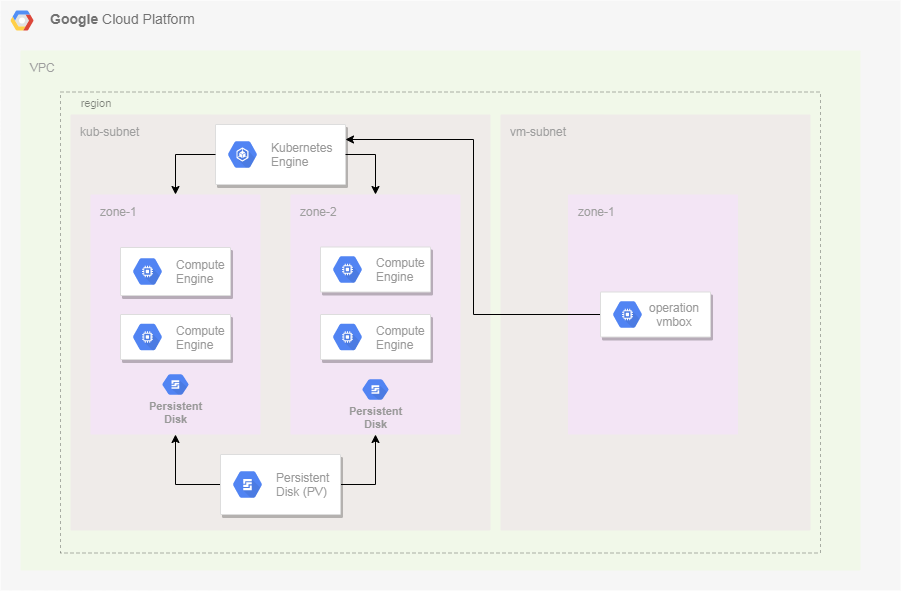

================================================================================
                               GKE Bootstrapper
================================================================================

Introduction
=============

From developer to operations in big companies, there is always a need to have a 
consistent development envirolment. This development needs to be cheap and also
fast enough to go along with the desire to innovate and take your IT challanges
even further. This repo is intended to bootstrap a GKE cluster on GCP free tier
accont but not limited to development envirolments. Due to HA capabilities plus
autoscaller, it is duable to bring this stack to production envirolments on GCP.

---
## Overwall architechture



---
## Architechture Components

The GKE Bootstrapper consists of several components.

        * GKE Cluster in 2 zones with horizontal autoscalling
        * Istio 1.3.0 for service mesh
        * Helm for Kubernetes package management

---
## How to use this repository
This section explain how to use this repository to bootstrap a production 
ready GKE cluster. Change values and script according to your needs, but 
keep in mind that the defaults are working properly and changes to scripts
and YAML's might destroy the sinergy of the scripts.

### Fill variables under src/values.sh

| Parameter                | Description                         | Example            |
|--------------------------|-------------------------------------|--------------------|
| `PROJECT_ID`             | gcloud project id                   | sandbox-251021     |
| `CLUSTER_NAME`           | name of GKE cluster                 | kub-cluster-001    |
| `REGION`                 | VPC region to host infra            | us-central1        |
| `OWNER_EMAIL`            | owner email of the GCP account      | eveuca@gmail.com   |
| `DOMAIN`                 | domain to add into GCP CloudDNS     | arakaki.in         |

### Run GKE provisioner script

To provision the cluster and other necessary resources, use the bellow script.

```
cd src
./apply.sh
```

This will create the underlaying cloud infrastructure for the GKE cluster.
By production ready, it means: Google Kubernetes Engine Multizonal Cluster (4 x n1-standard-2) With Horizontal Node Autoscaling. 
It also deploys a zone under CloudDNS. CloudDNS is the Route53 of GCP. 
The zone is named `istio` and it is configured to work with the GKE istio load balancer.

Istio 1.3.0 is also available within your cluster.

You can check the progress by running `kubectl get pods -n istio-system`. The ouput should be the following:

```
NAME                                       READY   STATUS      RESTARTS   AGE
istio-citadel-5949896b4b-dfrlh             1/1     Running     0          18m
istio-cleanup-secrets-1.1.12-v67hn         0/1     Completed   0          18m
istio-galley-d87867b67-vh8pd               1/1     Running     0          18m
istio-ingressgateway-7c96766d85-ds6kt      1/1     Running     0          18m
istio-init-crd-10-2-c6wrt                  0/1     Completed   0          18m
istio-init-crd-11-2-52mpn                  0/1     Completed   0          18m
istio-pilot-797844976c-xc2ts               2/2     Running     0          18m
istio-policy-99fd7f7f5-6rdmz               2/2     Running     8          18m
istio-security-post-install-1.1.12-947tm   0/1     Completed   5          18m
istio-sidecar-injector-5b5454d777-nrcj9    1/1     Running     7          18m
istio-telemetry-cdf9c6d7-q9zgj             2/2     Running     8          18m
promsd-76f8d4cff8-nfghj                    2/2     Running     1          18m
```

TODO: Terraform the sh*t out of this script.

#### POSTBUILD: 

##### Confige DNS
Under CloudDNS, go to the created zone and copy the nameservers created for your domain:

    ns-cloud-c1.googledomains.com.
    ns-cloud-c2.googledomains.com.
    ns-cloud-c3.googledomains.com.
    ns-cloud-c4.googledomains.com.

Edit your domain provider to use the nameservers gathered previusly.

From now on, your cluster is ready to be used. It is a raw cluster,no observability
by default (besides the one from GCP Stackdriver).It is recommend to use Stackdriver,
but use the repo TOFILL to have observability over the kubernetes objects into your cluster

# Operators manual

**Note: shutdown cluster info is wrong! You need to delete the autoscaller pool and resize the default-pool to 0**
Shutdown cluster 
```
gcloud container clusters resize kub-cluster-001 --num-nodes=0 --zone=us-central1-a --node-pool=default-pool
gcloud container clusters resize kub-cluster-001 --num-nodes=0 --zone=us-central1-a --node-pool=pool-horizontal-autoscaling
```

Interesting alias:
```
alias kist="kubectl -n istio-system"
```

Force Deployment/Statefulset update without deleting
```
kubectl patch deployments DEPLOYNAME -p  "{\"spec\":{\"template\":{\"metadata\":{\"annotations\":{\"dummy-date\":\"`date +'%s'`\"}}}}}"
```