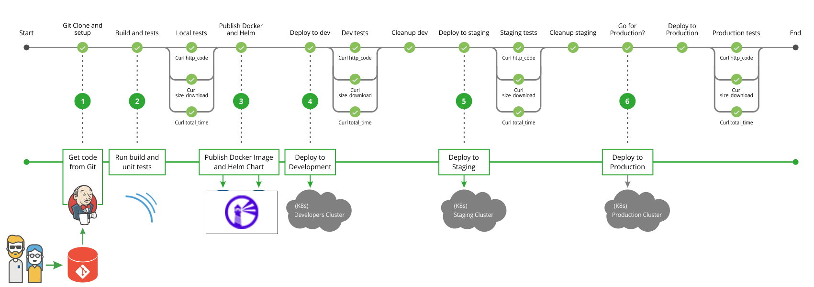
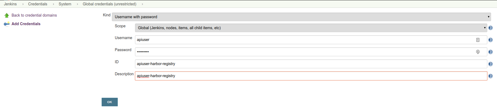
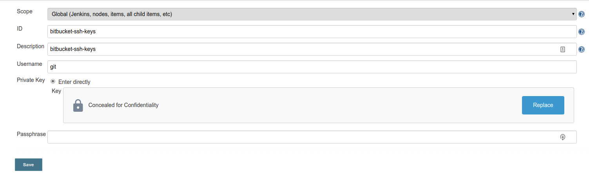
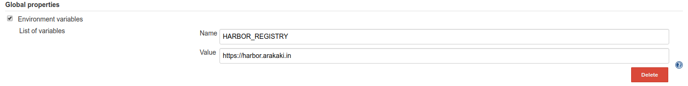
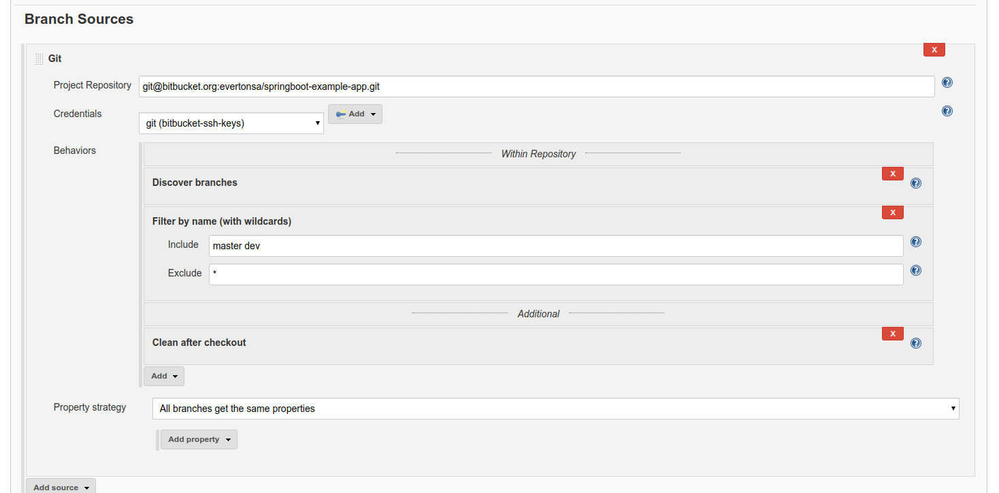

# GKE k8s bootstrapper

## Overwall architechture


## How to use this repository
This section explain how to use this repository to bootstrap a production ready GKE cluster. Change values and script according to your needs, but keep in mind that the defaults are working properly and changes to scripts and YAML's might destroy the sinergy of the scripts.

### Clone the GCP bootstrapper repository

It is required to use Google Cloud Shell. 
Google Cloud Shell is a browser-based terminal that Google provides to interact with your GCP resources. It is backed by a free Compute Engine instance that comes with many useful tools already installed, including everything required to run this bootstrapper.

```
REPO_URL="https://source.cloud.google.com/sandbox-216902/gke-cluster-bootstrapper"
git clone $REPO_URL
cd gke-bootstrapper
```
### Fill variables under resources/values.sh

| Parameter                | Description                                                                                                            | Example                                                                                                     |
|--------------------------|------------------------------------------------------------------------------------------------------------------------|-------------------------------------------------------------------------------------------------------------|
| `PROJECT_ID`             | gcloud project id                                                                                                      | sandbox-251021                                                                                              |
| `CLUSTER_NAME`           | name of GKE cluster                                                                                                    | kub-cluster-001                                                                                     |
| `REGION`                 | VPC region to host infra, OPTIONS = {"lowest_price":["us-central1", "us-west1", "us-east1"], "lowest_latency":["southamerica-east1"]}                                                                                              | us-central1  |
| `OWNER_EMAIL`            | owner email of the GCP account                                                                                         | eveuca@gmail.com                                                                            |
| `SLACK_URL_WEBHOOK`      | https://lmgtfy.com/?q=how+to+get+slack+webhook+url                                                                     |                                                                                                             |
| `SLACK_CHANNEL`          | Slack channel                                                                                                          | meucanalnoslack                                                                                      |
| `SLACK_USER`             | Slack user                                                                                                             | usuarioroboslack                                                                                                     |

### Run GKE provisioner script

To provision the cluster and other necessary resources, use the bellow script.

```
cd resources
./00-build-kubernetes-gcp.sh
```

This will create the underlaying cloud infrastructure for the GKE cluster, deploy a GKE prodcution ready cluster and install three major components:

 - helm (package manager)
 - istio (service mesh)
 - cert-manager (Let's Encrypt TLS certificate manager)

By production ready, it means: Google Kubernetes Engine Multizonal Cluster (4 x n1-standard-2) With Horizontal Node Autoscaling. 

It also deploys a zone under CloudDNS. CloudDNS is the Route53 of GCP. 

The zone is named `istio` and it is configured to work with the GKE istio load balancer.

*Only continue to the next step when the istio objects are up and running. There is a strict dependency of the other objects to istio control plane*

You chan check the progress by running `kubectl get pods -n istio-system`. The ouput should be the following:

```
NAME                                       READY   STATUS      RESTARTS   AGE
istio-citadel-5949896b4b-dfrlh             1/1     Running     0          18m
istio-cleanup-secrets-1.1.12-v67hn         0/1     Completed   0          18m
istio-galley-d87867b67-vh8pd               1/1     Running     0          18m
istio-ingressgateway-7c96766d85-ds6kt      1/1     Running     0          18m
istio-init-crd-10-2-c6wrt                  0/1     Completed   0          18m
istio-init-crd-11-2-52mpn                  0/1     Completed   0          18m
istio-pilot-797844976c-xc2ts               2/2     Running     0          18m
istio-policy-99fd7f7f5-6rdmz               2/2     Running     8          18m
istio-security-post-install-1.1.12-947tm   0/1     Completed   5          18m
istio-sidecar-injector-5b5454d777-nrcj9    1/1     Running     7          18m
istio-telemetry-cdf9c6d7-q9zgj             2/2     Running     8          18m
promsd-76f8d4cff8-nfghj                    2/2     Running     1          18m
```

TODO: Terraform the sh*t out of this script.

#### POSTBUILD: Create Ingress Gateway Letsencrypt certificate and configure DNS

##### Confige DNS
Under CloudDNS, go to the created zone and copy the nameservers created for your domain:

    ns-cloud-c1.googledomains.com.
    ns-cloud-c2.googledomains.com.
    ns-cloud-c3.googledomains.com.
    ns-cloud-c4.googledomains.com.

Edit your domain provider to use the nameservers gathered previusly.

##### Gateway certificate

To have Letsencrypt, we need to request a valid TLS certificate from Letsencrypt Certificate Authority. In `resourses/tmp/ssl-certificates/10-istio-gateway-cert.yaml`, you will find a template of a certificate to be applyed to your cluster. You can edit it and apply using `kubectl apply -f <FILE>` or simply use the snippet bellow, of course with your domain information. 

```
DOMAIN="arakaki.in"
kubectl apply -f - <<EOF
apiVersion: certmanager.k8s.io/v1alpha1
kind: Certificate
metadata:
  name: istio-gateway
  namespace: istio-system
spec:
  secretName: istio-ingressgateway-certs
  issuerRef:
    name: letsencrypt-prod
  commonName: "*.${DOMAIN}"
  acme:
    config:
    - dns01:
        provider: cloud-dns
      domains:
      - "*.${DOMAIN}"
      - "${DOMAIN}"
EOF
```
This is a wildcarded certificate, meaning that all subdomains connections will be wrapped with TLS using one and only one certificate.To see if your certificate is ready:

```
kubectl -n istio-system get certificates
```

When the certificate is Ready, you will need to renew Istio Pod to use the new certificate. As your Istio Pod is scheduled using a Deployment object, you can simply kill de pod with: 

```
kubectl -n istio-system delete pods -l istio=ingressgateway
``` 

To debug possible errors, use:
```
kubectl -n cert-manager get pods
kubectl -n cert-manager logs -f <cert-manager-xxxxxx-xxxxxxx>
```

For testing, you can copy and paste the bellow code (of course, change DOMAIN to your domain): 

```
DOMAIN="arakaki.in"
helm repo add sp https://stefanprodan.github.io/podinfo
helm upgrade my-release --install sp/podinfo 
kubectl apply -f - <<EOF
apiVersion: networking.istio.io/v1alpha3
kind: VirtualService
metadata:
  name: test-gke-pod
  namespace: default
spec:
  hosts:
   - "test-gke-pod.${DOMAIN}"
  gateways:
  - public-gateway.istio-system.svc.cluster.local
  http:
  - route:
    - destination:
        host: my-release-podinfo
        port:
          number: 9898
EOF
```

To cleanup this test pod, run:

```
helm delete --purge my-release
kubectl delete virtualservice test-gke-pod
```

Access https://test-gke-pod.${DOMAIN}. If you have an error, you probably forgot to delete the istio-gateway pod or to change tour nameserver config.

From now on, your cluster is ready to be used. It is a raw cluster, no observability by default. We recommend following the bellow steps to deploy the mon, log and cid stack.

### Run LOG provisioner script

To provision logging resources, use the bellow script.
```
./10-build-log-objects.sh
```

This will provision 3 log resources:
- Elasticsearch (3 nodes) as Statefulset
- Fluentd as Daemonset (spread all over the VM's)
- Kibana 

You chan check the progress by running `kubectl -n log get pods`. The ouput should be the following:

```
NAME                              READY   STATUS    RESTARTS   AGE
elasticsearch-0                   2/2     Running   0          2m12s
elasticsearch-1                   2/2     Running   0          83s
elasticsearch-2                   2/2     Running   0          52s
fluentd-6825s                     2/2     Running   1          2m10s
fluentd-fl579                     2/2     Running   1          2m10s
fluentd-lnjqt                     2/2     Running   1          2m10s
fluentd-vl5xq                     2/2     Running   1          2m10s
kibana-logging-5db895d95c-hr8ds   2/2     Running   0          2m9s
```

As Kibana does not provide a authentication, I chose not to keep it public. To access Kibana (https://kibana-log.YOURDOMAIN.COM), run the bellow command (can be found under resourses/tmp/istio-virtual-services/log/kibana-log-vs.yaml)

```
DOMAIN="arakaki.in"
kubectl apply -f - <<EOF
apiVersion: networking.istio.io/v1alpha3
kind: VirtualService
metadata:
  name: kibana
  namespace: log
spec:
  hosts:
  - "kibana-log.${DOMAIN}"
  gateways:
  - public-gateway.istio-system.svc.cluster.local
  http:
  - route:
    - destination:
        host: kibana-logging
EOF
```

Kibana is not configured and it will require further work to have enhanced observability, but the fluentd daemonset is already collecting data from all applications logging to stdout. To check it, create an index pattern `*` and bound to `@timestamp`. This will give you some nice information on *Discover* window:

```
September 6th 2019, 15:49:04.000	GET /api/status 200 2ms - 9.0B
September 6th 2019, 15:49:02.000	GET /api/status 200 6ms - 9.0B
September 6th 2019, 15:48:54.000	GET /api/status 200 2ms - 9.0B
```

Delete the VirtualService when you are done playing around. It is not safe to have Kibana open to the world.

```
kubectl -n log  delete virtualservice kibana 
```

TODO: implement security authentication layer over Kibana

### Run MON provisioner script

To provision logging resources, use the bellow script.
```
./10-build-mon-objects.sh
```

You chan check the progress by running `kubectl -n log get pods`. The ouput should be the following:

```
alertmanager-d5475f677-4d4xl            2/2     Running   0          22m
grafana-6ddd9cc4d5-7ptst                3/3     Running   0          81s
kube-state-metrics-d575c5f88-x25gg      3/3     Running   2          22m
node-exporter-7spfm                     1/1     Running   0          22m
node-exporter-rsjbn                     1/1     Running   0          22m
node-exporter-szgdp                     1/1     Running   0          22m
node-exporter-vpbbv                     1/1     Running   0          22m
prometheus-deployment-5466b4584-glxv2   2/2     Running   0          22m
```

There are 4 Dashboards already configured + alertmanager sending slackwebhooks in case some metrics goes wild. 

To visualize the grafana, use be bellow code, replacing the DOMAIN value with your domain. 

```
DOMAIN="arakaki.in"
kubectl apply -f - <<EOF
apiVersion: networking.istio.io/v1alpha3
kind: VirtualService
metadata:
  name: grafana
  namespace: mon
spec:
  hosts:
  - "grafana-mon.${DOMAIN}"
  gateways:
  - public-gateway.istio-system.svc.cluster.local
  http:
  - route:
    - destination:
        host: grafana
EOF
```

Default admin user is `admin` and the password can be gathered with:
```
kubectl get secret --namespace mon grafana -o jsonpath="{.data.admin-password}" | base64 --decode ; echo
```

It is a best practice to create readonly users to bussiness guys and first level support. 

//TODO: 

### Run CID provisioner script

```
Note from a GCP Engineer: the bellow code is garbage. You are on the cloud. Use the cloud. Google Cloud Repository + Google Container Registry + Cloud Build + Cloud Trigger is the best way to go for a CID stack on the cloud. I have worked on the bellow but it recommended to apply Cloud Best Practices in a cloud envirolment. 
```

To provision logging resources, use the bellow script.
```
./30-build-cid-objects.sh
```

This part is a bit intense. The list bellow sumarizes the resources that are provisioned.

 - Harbor (Container Registry)
 - Jenkins (Job Tooling)
 - Sonarqube (Mvn/gradle code analisys)
 - Redis (for Harbor and Integration Testing)
 - Postgres (for Harbor and Integration Testing)

 The general idea is described bellow:



But in order to get the above running, some manual configurations (unfortunatelly) are needed.

1. Setup Harbor apiuser for push/pull images
2. Setup apiuser on Jenkins
3. Setup Sonarqube to work on Jenkins

#### Setup Harbor apiuser for push/pull images

1. Login into Harbor on https://harbor.{DOMAIN}. 
2. User admin:admin is configured as default, first thing todo is to change the admin password. You can change it on the top right corner.
2. Delete *library* project. This is a default and public. We do not need this.
2. Let us also disable self registration. Under `Administration > Configuration > Authentication`, untick `Allow Self-Registration`.
3. Now its time to create a new user for the registry, under `Administration >  Users > New Users`. Create an apiuser user. Note down the password for next steps. 
4. for Kubernetes namespaces to be able to pull from harbor you will need to distribute this secret to other namespaces. The bellow code uses kubed to perform such task.

First declare the variables bellow:

```
DOMAIN="arakaki.in"
USER="apiuser"
PASSWORD="FROMPREVIUSSTEP"
```

Run the bellow code to spread a docker pull regcred secret:

```
kubectl create secret docker-registry regcred --docker-server=https://harbor.${DOMAIN} --docker-username=${USER} --docker-password=${PASSWORD} --docker-email=whatever@we.com
kubectl label namespace dev app=kubed
kubectl label namespace ite app=kubed
kubectl label namespace prd app=kubed
kubectl annotate secret regcred kubed.appscode.com/sync="app=kubed"
```

Now you can use `regcred` as your imagePullSecrets.

#### Setup apiuser on Jenkins

By default, Jenkins is not externally opened. To access it, you can use the bellow snippet (change DOMAIN variable to your domain), and there is also a template under resourses/tmp/istio-virtual-services/cid/jenkins-vs.yaml)

```
DOMAIN="arakaki.in"
kubectl apply -f - <<EOF
apiVersion: networking.istio.io/v1alpha3
kind: VirtualService
metadata:
  name: jenkins
  namespace: cid
spec:
  hosts:
  - "jenkins-cid.${DOMAIN}"
  gateways:
  - public-gateway.istio-system.svc.cluster.local
  http:
  - route:
    - destination:
        host: jenkins
EOF
```

Default admin user is `admin` and the password can be gathered with:
```
printf $(kubectl get secret --namespace cid jenkins -o jsonpath="{.data.jenkins-admin-password}" | base64 --decode);echo
```

For the automation to work properly, you will need to add the apiuser credentials under Jenkins. 

Go to `Credentials > Jenkins > Global Credentials > Add Credentials` and add the *apiuser* from the Harbor Registry. Simple user and password, no different configuration is needed. 



Now Jenkins need to connect to a git repository. Google for adding ssh git key to Jenkins. 



Next and last stuff, you will need to run the bellow code on Cloud Shell:

```
kubectl create clusterrolebinding permissive-binding --clusterrole=cluster-admin --user=admin --user=kubelet --group=system:serviceaccounts
```

Now we configure a Jenkins Envirolment Variable: 



#### Setup Sonarqube

Although I'm not well experienced with Sonarqube, I gave it a try. To access externally, see bellow:

```
DOMAIN="arakaki.in"
kubectl apply -f - <<EOF
apiVersion: networking.istio.io/v1alpha3
kind: VirtualService
metadata:
  name: sonarqube
  namespace: cid
spec:
  hosts:
  - "sonarqube-cid.${DOMAIN}"
  gateways:
  - public-gateway.istio-system.svc.cluster.local
  http:
  - route:
    - destination:
        host: sq-sonarqube
EOF
```

login into https://sonarqube-cid.${DOMAIN} and login as admin:admin. Generate a user apiuser and copy the token value.

Following the tutorial, you will have the following output for a Maven project.

```
mvn sonar:sonar \
  -Dsonar.host.url=https://sonarqube-cid.arakaki.in \
  -Dsonar.login=33e30ea684e5636af4d7ec8b12c8ed67bba1fde3
```
Sonarqube can run analisys over Python and Javascript also, but this tutorial is not going to go through it. 

# Development/operation process for CI/CD Solution

We now have everything we need. 
Jenkins is capable of deploying to multiple namespaces.
Sonarqube is configured to run as you wish.
Harbor is holding docker container images.
You now have stablish a development process along your development team.
This includes branch stategy, tags, deployments strategy, integration testing and so on.
Things can go wild in this step. I will try to sumarize my ideas of a good effort/productivity process.
The envirolment is ready for you to play around and allign the best strategy that fits for you. 

My major dev2prod process idea is:

1. developer develops local, testing if application runs locally. Resources needed (db, queues, cache) always comes from the dev namespace.
2. developer align if code is good, create a pull request to the dev branch.
3. after aproval, the CID system builds the dockerfile and push it to container registry
4. with Helm, updates the running release on dev namespace to the new image. 
5. developers confirms with the operations team that the container is stable and ready to be deployed to ite and prd envirolments.

Now merge from dev to master takes place. And again, automation would take control of deploying to prd envirolment.

Bellow I describe with an example how I would setup a complete dev/prd cid canary strategy:

First, the jenkins config:

`Create New Job > Multibranch Pipeline > `




This will need you to have a look into:

https://bitbucket.org/evertonsa/springboot-example-app

See how the Jenkinsfile, branches and the chart directory is structured.

On day 0, in order for the canary to work properly, you will need the following (on the springboot-example-app repo):

This snippet will deploy the springboot app with **no canary** on dev namespace, but with external access!

```
helm install --name app-dev-release ./springboot-example-app-chart --set=canary.enabled=false --set=virtualService.enabled=true --set=virtualService.host=backend-spring-dev.arakaki.in --namespace dev
```

This snippet will deploy the springboot app with canary and external access!
```
helm install --name app-prd-release springboot-example-app-chart/ --set=canary.enabled=true --set=canary.virtualService.enabled=true --set=canary.virtualService.host=backend-spring.arakaki.in --namespace prd
```

# Operators manual

Shutdown cluster (I think the bellow is wrong. If you scale down the default-pool, might be that the autoscaling pool is triggered due to pod requests. I need to investigate...)
```
gcloud container clusters resize kub-cluster-001 --num-nodes=0 --zone=us-central1-a --node-pool=default-pool
gcloud container clusters resize kub-cluster-001 --num-nodes=0 --zone=us-central1-a --node-pool=pool-horizontal-autoscaling
```

Turn on cluster:
```
gcloud container clusters resize kub-cluster-001 --num-nodes=1 --zone=us-central1-a --node-pool=default-pool
gcloud container clusters resize kub-cluster-001 --num-nodes=1 --zone=us-central1-a --node-pool=pool-horizontal-autoscaling
```

Interesting alias:
```
alias klog="kubectl -n log"
alias kmon="kubectl -n mon"
alias kcid="kubectl -n cid"
alias kdev="kubectl -n dev"
alias kite="kubectl -n ite"
alias kprd="kubectl -n prd"
```

Force Deployment/Statefulset update without deleting
```
kmon patch deployments prometheus-deployment -p  "{\"spec\":{\"template\":{\"metadata\":{\"annotations\":{\"dummy-date\":\"`date +'%s'`\"}}}}}"
```